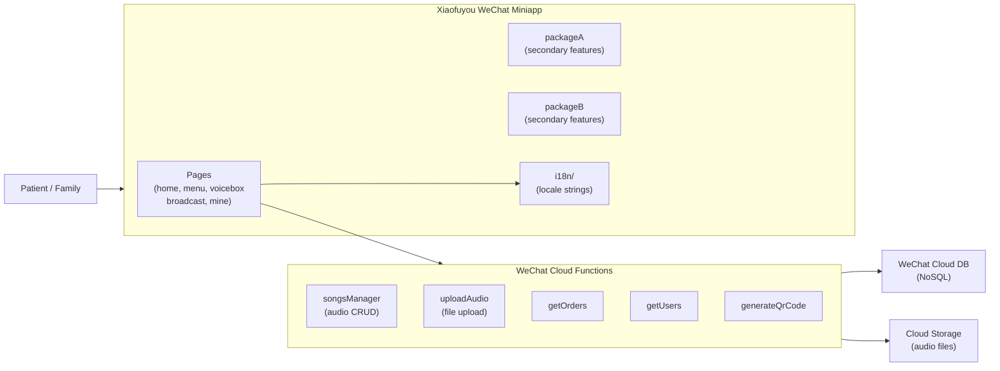

# Xiaofuyou-WxApp · ICU Music Therapy WeChat Miniapp

> **A public-welfare WeChat miniapp for music therapy in ICU settings — cloud-function-backed audio management, multi-package architecture, and i18n support.**
>
> 公益项目：ICU 音乐疗愈微信小程序，云函数驱动音频管理，分包架构加速首屏，内置 i18n 国际化支持。

[English](#english) · [中文](#中文)


---

<a id="english"></a>

## Architecture



## Quickstart

```bash
# 1. Open WeChat DevTools → Import project (select this directory)
# 2. Set your AppID in project.config.json
# 3. Enable WeChat Cloud Development in DevTools console
# 4. Deploy cloud functions: right-click each in cloudfunctions/ → Upload
# 5. Click Compile & Preview
```

## Features

| Page | Description |
|---|---|
| `home` | Welcome + entry navigation |
| `menu` | Music category browser |
| `voicebox` | Voice message recording + playback |
| `broadcast` | Audio broadcast / streaming |
| `mine` | Personal profile + history |
| `myQrCode` | User QR code generation |

## Technical Highlights

<details>
<summary><b>Cloud-function-backed audio management — zero server setup</b></summary>

- **S**: A public-welfare project with no server budget needs reliable audio upload and playback without managing infrastructure.
- **A**: `songsManager` and `uploadAudio` cloud functions handle audio CRUD and file upload directly to WeChat Cloud Storage. Cloud DB stores metadata. No backend server, no server costs.
- **R**: Full audio management stack deployed with WeChat Cloud Development; one-click redeploy via DevTools.
</details>

<details>
<summary><b>Multi-package architecture for faster first load</b></summary>

- **S**: WeChat miniapp initial package has a 2MB size limit; cramming all pages in one package delays first render.
- **A**: Core pages (home, menu, voicebox) in the main package; secondary flows split into `packageA` and `packageB` as subpackages. WeChat loads subpackages on demand.
- **R**: Main package stays under the limit; secondary features load only when navigated to.
</details>

<details>
<summary><b>i18n internationalization</b></summary>

- **S**: ICU patients and families may be from non-Chinese-speaking backgrounds.
- **A**: `i18n/` directory contains locale string files wired into page components via a lightweight helper. Language can be switched at runtime.
- **R**: Supports multilingual operation without duplicating page code.
</details>

## Roadmap

- [x] Audio browse, play, broadcast
- [x] Voice message recording
- [x] Cloud functions for audio CRUD
- [x] QR code generation per user
- [x] i18n support
- [ ] Doctor/family remote message push
- [ ] Mood tracking & therapy session log
- [ ] AI-recommended music by patient state

---

<a id="中文"></a>

## 中文速读

- **是什么**：ICU 音乐疗愈公益小程序，微信云开发驱动（云函数 + 云存储 + 云数据库），零服务器成本，支持音频管理、语音留言、二维码生成。
- **亮点**：分包架构（packageA/B）规避 2MB 主包限制，按需加载；i18n 目录支持多语言，无需重复页面代码。
- **运行**：微信开发者工具导入项目 → 配置 AppID → 开通云开发 → 上传云函数 → 编译预览。

## License

MIT © [Seal-Re](https://github.com/Seal-Re)
